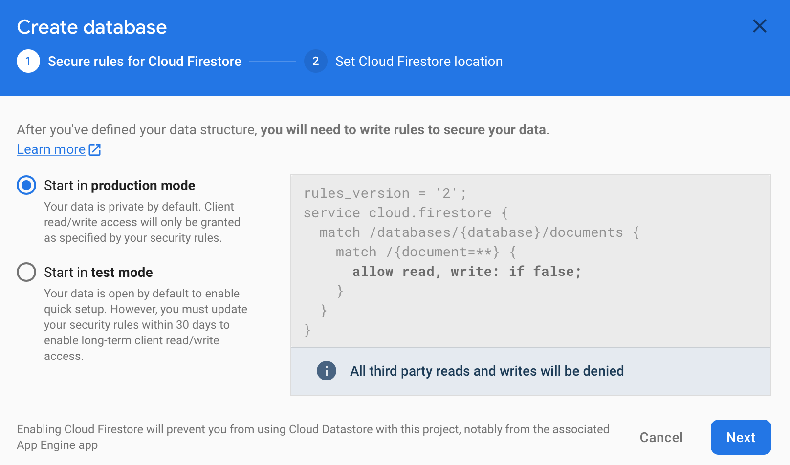

# Firestore Demo

A simple demo of firestore database to perform CRUD operations.

Hello people! Today we are going to learn how to implement firestore databse in our flutter app using `cloud_firestore`.

**Cloud Firestore** is a flexible, scalable database for mobile, web, and server development from Firebase and Google Cloud. Like Firebase Realtime Database, it keeps your data in sync across client apps through realtime listeners and offers offline support for mobile and web so you can build responsive apps that work regardless of network latency or Internet connectivity. Cloud Firestore also offers seamless integration with other Firebase and Google Cloud products, including Cloud Functions.


        #ClouD Firebase
        #“Store and sync data for client- and server-side development”

To make it more interesting, we are creating an app to store contacts on firestore databse. We will prform CRUD operations using `cloud_firestore`. Just a small app only for demonstration. No high expectations please. Haha!

Lets begin!!!


## Step 1 : Project Setup

First things first! Go ahead and create a project in firebase console.

Create a new project in [Google Firebase Console](https://console.firebase.google.com/)


Once you provide the project name click on continue.


This is optional. You can disable the toggle if you don't want google analytics for your project. Once done click continue.


If your opt for google analytics then select the account for it as shown above.

### Android

The next step is to add firebase to android app.


Once done. Go ahead and download the `google-services.json` file and place it in your project as shown.


Then add the below line of code to your `app/build.gradle` file.

```

apply plugin: 'com.google.gms.google-services'

```

Next step is to add the below line of code to your `project/build.gradle` file.

```

classpath 'com.google.gms:google-services:4.2.0'

```

Keep your minSdkVersion equals or above 23 as Firestore supports only after level 23 of android.

### iOS

Add ios app to firebase with the bundle id of your App.


Go ahead and download the `GoogleService-info.plist` file and place it in your project as shown.


### Create Firesore Database

Go ahead and select `Firestore Database` and click on `Create Database` to create a new **Firestore Database**


Now select the security rules for the database.



Location setting is required. So select your location and click on Enable.


That's it folks! Now we are all set with the project setup. Let's move ahead on the flutter side of our project.


## Step 2 :  Install Packages

Place the below dependencies in your `pubspec.yaml` file and run `flutter pub get`
```
  
  cloud_firestore: ^0.11.0+2
  
```

## Step 3 : Create Firestore Instance

Create the 1st model class file as `items.dart`

```

Firestore fireStoreDataBase = Firestore.instance;

```

## Step 4 : Fetch Contacts

In Firestore database the data is saved in the `document` similar to rows in sequential database. These documents are saved in `collections` which are similar to tables in sequential database.

```

StreamBuilder<QuerySnapshot>(
        stream: fireStoreDataBase.collection("contacts").snapshots(),
        builder: (context, snapshot) {
          if (snapshot.hasData) {
            documents = snapshot.data.documents;
            return buildContactList();
          } else {
            return Center(
              child: CircularProgressIndicator(),
            );
          }
        },
      ),  
      
```

## Step 5 : Create Record

`createContact()` is used to create new contact as shown below.

```
 void createContact(
      String firstName, String lastName, String mobileNo, String email) async {
    await fireStoreDataBase
        .collection("contacts")
        .add({
      'firstName': firstName,
      'lastName': lastName,
      'mobileNo': mobileNo,
      'email': email
    });
    ScaffoldMessenger.of(context)
        .showSnackBar(SnackBar(content: Text("Contact Created..!!")));
  }
```

Calling the above method will create a new document in our collection.

## Step 6 : Update Record

`updateContact()` is used update an existing document on the basis of `documentId`.

```
void updateContact(String documentId, String firstName, String lastName,
      String mobileNo, String email) {
    try {
      fireStoreDataBase.collection('contacts').document(documentId).updateData({
        'firstName': firstName,
        'lastName': lastName,
        'mobileNo': mobileNo,
        'email': email
      });
      ScaffoldMessenger.of(context)
          .showSnackBar(SnackBar(content: Text("Contact Updated..!!")));
    } catch (e) {
      print(e.toString());
    }
  }
```

Calling the above method will update the document corresponding to the referenced documentId.

## Step 6 : Delete Record

`deleteContact()` is used delete an existing document on the basis of `documentId`.

```
 void deleteContact(String documentId) {
    try {
      fireStoreDataBase.collection('contacts').document(documentId).delete();
      ScaffoldMessenger.of(context)
          .showSnackBar(SnackBar(content: Text("Contact Deleted..!!")));
    } catch (e) {
      print(e.toString());
    }
  }
```

Calling the above method will delete the document corresponding to the referenced documentId.


That's it folks! We're done with all the coding. Just go ahead and run your app!

Fantastic!! You have just learned how to **C**reate, **R**ead, **U**pdate, **D**elete in the cloud firestore database.

## Important:

This repository is only for demonstrating `cloud_firestore`. Please do not misuse it.

## Author:

* [Amit Mishra](https://github.com/amitmishra7)

If you like this tutorial please don't forget to add a **Star**. Also follow to get informed for upcoming tutorials.
